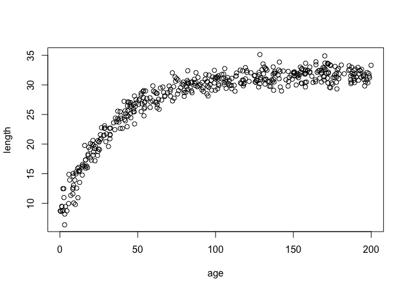
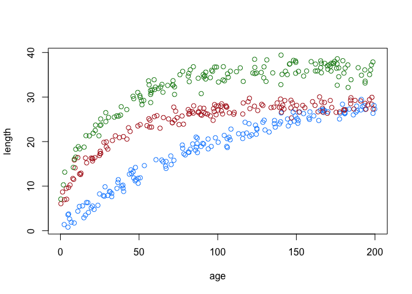
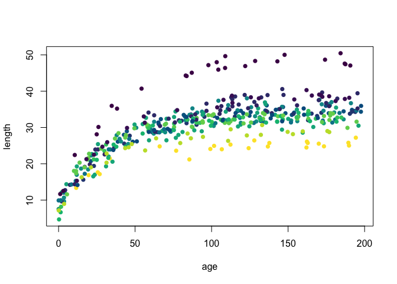
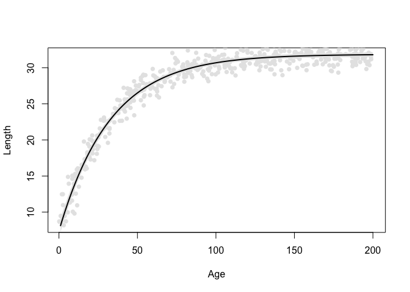
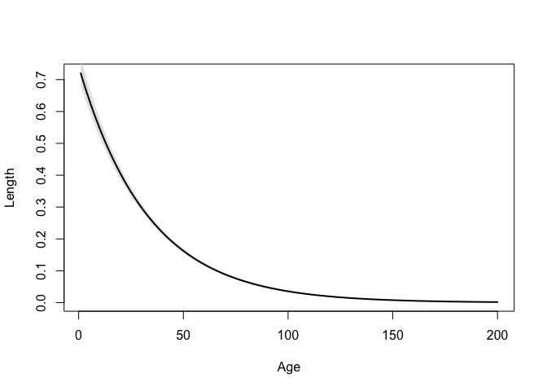

<!-- README.md is generated from README.Rmd. Please edit that file -->

# growthstack

<!-- badges: start -->

[](https://github.com/williamkannis/growthstack/actions/workflows/R-CMD-check.yaml)

<!-- badges: end -->

Tools to model growth using von Bertalanffy, Gompertz, and Logistic
Bayesian hierarchical models, and to perform Bayesian model stacking.
Many functions are wrappers of functions from the ‘rstan’ and ‘loo’
packages.

## Installation

You can install the development version of growthstack from
[GitHub](https://github.com/) with:

``` r
# install.packages("pak")
pak::pak("williamkannis/growthstack")
```

## Single model inference

### Random effect model

Simulates and fits length-at-age data with von Bertalanffy model,
allowing parameters to vary by sampling groups.

Simulate growth data with random groupings

``` r
library(growthstack)

# Prepare simulation inputs
input_list_ran <- list(
  
  # Sample size
  n_sites = 18,
  n_ages = 25,
  max_age = 200,
  
  # Length varaince
  sigma_length = 1,
  
  # Random effect means
  mu_Linf =32,  
  mu_g = 0.03,
  mu_t = -9,
  
  # Random effect variance and correlations
  tau = c(0.02,0.03,2),  
  cor.Linf.g =-.49,
  cor.Linf.t = .05,
  cor.g.t = 0.2
)

# Data simulation
data_ran <- simulate_length(
  sim.input = input_list_ran,
  mod.form = "vb",
  nu=0,
  fixed.effect="random",
  equal.cat=T
) 

# View data
plot(
  length~age,
  data_ran
  )
```



Fit model

``` r

# Run model
out_list_ran <- fit_growth(
  mod.form = "vb",
  nu=0,
  fixed.effect = "random",
  sample.groups = "sample_id",
  sp = "sim",   
  age.df = data_ran, 
  iter = 5000,
  warmup = 2000,
  chains =4,
  cores = 4,
  refresh = 0,
  control = list(adapt_delta = .97), 
  parallel = F
)

# Extract model result
fit_ran <- out_list_ran$model_out$vb_random
```

Print some results

``` r
# Print results for select paramters
params_ran <- c("mu_Linf","mu_g1","mu_t0","tau","sigma_length")
print(fit_ran,pars = params_ran)
#> Inference for Stan model: anon_model.
#> 4 chains, each with iter=5000; warmup=2000; thin=1; 
#> post-warmup draws per chain=3000, total post-warmup draws=12000.
#> 
#>               mean se_mean   sd   2.5%   25%   50%   75% 97.5% n_eff Rhat
#> mu_Linf      31.86    0.00 0.16  31.55 31.75 31.86 31.96 32.17  5584    1
#> mu_g1         0.03    0.00 0.00   0.03  0.03  0.03  0.03  0.03 15102    1
#> mu_t0        -8.71    0.01 0.74 -10.22 -9.17 -8.70 -8.22 -7.28  9162    1
#> tau[1]        0.02    0.00 0.00   0.01  0.01  0.02  0.02  0.03  5408    1
#> tau[2]        0.02    0.00 0.02   0.00  0.01  0.02  0.03  0.07  5420    1
#> tau[3]        2.24    0.01 0.53   1.35  1.87  2.19  2.55  3.42  5323    1
#> sigma_length  1.01    0.00 0.04   0.94  0.98  1.01  1.03  1.08 15944    1
#> 
#> Samples were drawn using NUTS(diag_e) at Mon Sep 28 10:58:22 2026.
#> For each parameter, n_eff is a crude measure of effective sample size,
#> and Rhat is the potential scale reduction factor on split chains (at 
#> convergence, Rhat=1).
```

Create length-at-age curves

### Categorical effects model

Simulates and fits length-at-age data with von Bertalanffy model,
allowing parameters to vary by sampling groups with variation in growth
parameters explained by categorical groupings

Simulate growth data with categorical effects

``` r
library(growthstack)
## basic example code

# Prepare simulation inputs
input_list_cat <- list(
  
  # Sample size
  n_sites = 18,
  n_ages = 25,
  max_age = 200,
  
  # Length varaince
  sigma_length = 1,
  
  # Random effect means by effect category
  cat_Linf =c(28,32,36),
  cat_g =c(.03,.01,.03),
  cat_t =c(-9,-2,-11),
  
  # Random effect variance and correlations
  tau = c(0.02,0.03,2),  
  cor.Linf.g =-.49,
  cor.Linf.t = .05,
  cor.g.t = 0.2
)

# Data simulation
data_cat <- simulate_length(
  sim.input = input_list_cat,
  mod.form = "vb",
  nu=0,
  fixed.effect="categorical",
  equal.cat=T
) 

# View data
cat_color <- c("firebrick", "dodgerblue", "forestgreen")
plot(
  length~age,
  data_cat, 
  col = cat_color[data_cat$cat]
  )
```



Fit model

``` r

# Run model
out_list_cat <- fit_growth(
  mod.form = "vb",
  nu=0,
  fixed.effect = "categorical",
  sample.groups = "sample_id",
  category = "cat",
  sp = "sim",   
  age.df = data_cat, 
  len.df = NULL,
  iter = 5000,
  warmup = 2000,
  chains =4,
  cores =4,
  control = list(adapt_delta = .97), 
  refresh = 0,
  parallel = F
)

# Extract model result
fit_cat <- out_list_cat$model_out$vb_categorical
```

Print some results

``` r

# Print results for select parameters
params_cat <- c("cat_Linf","cat_g1","cat_t0","tau","sigma_length")
print(fit_cat,pars = params_cat)
#> Inference for Stan model: anon_model.
#> 4 chains, each with iter=5000; warmup=2000; thin=1; 
#> post-warmup draws per chain=3000, total post-warmup draws=12000.
#> 
#>                mean se_mean   sd   2.5%    25%    50%    75% 97.5% n_eff Rhat
#> cat_Linf[1]   28.22    0.01 0.39  27.43  27.97  28.22  28.47 29.00  4021    1
#> cat_Linf[2]   32.64    0.01 0.82  31.14  32.08  32.61  33.17 34.31  4950    1
#> cat_Linf[3]   36.28    0.01 0.47  35.35  35.98  36.28  36.59 37.21  4339    1
#> cat_g1[1]      0.03    0.00 0.00   0.03   0.03   0.03   0.03  0.03  9398    1
#> cat_g1[2]      0.01    0.00 0.00   0.01   0.01   0.01   0.01  0.01  5377    1
#> cat_g1[3]      0.03    0.00 0.00   0.03   0.03   0.03   0.03  0.03  9451    1
#> cat_t0[1]    -10.47    0.02 1.34 -13.24 -11.32 -10.43  -9.57 -7.94  7848    1
#> cat_t0[2]     -1.22    0.02 1.40  -4.06  -2.14  -1.21  -0.28  1.51  6667    1
#> cat_t0[3]    -10.95    0.02 1.41 -13.81 -11.85 -10.92 -10.02 -8.28  7456    1
#> tau[1]         0.03    0.00 0.01   0.02   0.02   0.03   0.03  0.05  4258    1
#> tau[2]         0.04    0.00 0.03   0.00   0.02   0.04   0.06  0.09  3398    1
#> tau[3]         2.19    0.01 0.68   1.03   1.72   2.13   2.60  3.72  3770    1
#> sigma_length   1.04    0.00 0.04   0.97   1.01   1.03   1.06  1.11 14138    1
#> 
#> Samples were drawn using NUTS(diag_e) at Mon Sep 28 10:59:34 2026.
#> For each parameter, n_eff is a crude measure of effective sample size,
#> and Rhat is the potential scale reduction factor on split chains (at 
#> convergence, Rhat=1).
```

Create categorical length- and growth-at-age curves

### Continuous effects model

Simulates and fits length-at-age data with von Bertalanffy model,
allowing parameters to vary by sampling groups with variation in growth
parameters explained by sample-level continuous predictors

Simulate growth data with continuous effects

``` r
library(growthstack)
## basic example code

# Prepare simulation inputs
input_list_cont <- list(
  
  # Sample size
  n_sites = 18,
  n_ages = 25,
  max_age = 200,
  
  # Length variance
  sigma_length = 1,
  
  # 2nd-level effect coefficients
  beta_Linf =c(-.09,0,.1),
  beta_g =c(.09,-.01,.08),
  beta_t =c(0,.03,-.08),
  
  # Random effect means
  mu_Linf =32,  
  mu_g = 0.03,
  mu_t = -9,
  
  # Random effect variance and correlations
  tau = c(0.02,0.03,2),  
  cor.Linf.g =-.49,
  cor.Linf.t = .05,
  cor.g.t = 0.2
)

# Data simulation
data_cont <- simulate_length(
  sim.input = input_list_cont,
  mod.form = "vb",
  nu=0,
  fixed.effect="continuous"
) 

# View data

cont_cols <- hcl.colors(100, "Viridis")
cont_color_indices <- cut(data_cont$X1, breaks = 100, labels = FALSE)

plot(
  length ~ age,
  data = data_cont,
  col = cont_cols[cont_color_indices],
  pch = 16
)
```



Fit model

``` r

# Run model
out_list_cont <- fit_growth(
  mod.form = "vb",
  nu=0,
  fixed.effect = "continuous",
  sample.groups = "sample_id",
  predictors = c("X1","X2","X3"),
  sp = "sim",   
  age.df = data_cont, 
  iter = 5000,
  warmup = 2000,
  chains =4,
  cores =4,
  control = list(adapt_delta = .97), 
  refresh = 0,
  parallel = F
)

# Extract model result
fit_cont <- out_list_cont$model_out$vb_continuous
```

Print some results

``` r

# Print results for select parameters
params_cont <- c(
  "beta_Linf","beta_g1","beta_t0",
  "mu_Linf","mu_g1","mu_t0","tau","sigma_length"
  )
print(fit_cont,pars = params_cont)
#> Inference for Stan model: anon_model.
#> 4 chains, each with iter=5000; warmup=2000; thin=1; 
#> post-warmup draws per chain=3000, total post-warmup draws=12000.
#> 
#>               mean se_mean    sd  2.5%   25%   50%   75% 97.5% n_eff    Rhat
#> beta_Linf[1]  0.29    0.47  0.67 -0.10 -0.10 -0.09  0.31  1.45     2  173.18
#> beta_Linf[2] -0.28    0.35  0.49 -1.14 -0.30  0.00  0.00  0.01     2  132.17
#> beta_Linf[3]  0.33    0.31  0.44  0.07  0.07  0.08  0.35  1.10     2  116.82
#> beta_g1[1]    0.51    0.47  0.67  0.09  0.12  0.14  0.58  1.66     2   38.82
#> beta_g1[2]    0.15    0.21  0.30 -0.07 -0.04 -0.02  0.21  0.67     2   16.64
#> beta_g1[3]    0.02    0.05  0.07 -0.10 -0.05  0.05  0.07  0.10     2    4.34
#> beta_t0[1]    0.87    0.40  0.83 -0.82  0.27  0.87  1.83  1.83     4    1.39
#> beta_t0[2]    0.49    0.02  0.63 -0.73  0.20  0.37  0.82  1.89  1302    1.01
#> beta_t0[3]   -0.11    0.59  1.01 -1.51 -1.51  0.08  0.64  1.63     3    1.76
#> mu_Linf      25.79   10.22 14.45  0.76 25.18 34.06 34.19 34.42     2  115.54
#> mu_g1         0.62    0.72  1.02  0.03  0.03  0.03  0.62  2.38     2 2090.23
#> mu_t0        -6.84    2.14  3.07 -9.82 -8.86 -8.30 -4.54 -1.63     2    5.67
#> tau[1]        1.27    1.54  2.18  0.01  0.01  0.02  1.29  5.04     2  639.66
#> tau[2]        1.04    1.24  1.75  0.00  0.01  0.03  1.12  4.07     2  121.40
#> tau[3]        1.58    0.54  0.89  0.31  0.31  1.72  2.18  3.21     3    1.84
#> sigma_length  2.29    1.60  2.26  0.93  0.97  1.00  2.39  6.21     2   81.61
#> 
#> Samples were drawn using NUTS(diag_e) at Mon Sep 28 11:01:29 2026.
#> For each parameter, n_eff is a crude measure of effective sample size,
#> and Rhat is the potential scale reduction factor on split chains (at 
#> convergence, Rhat=1).
```

## Multi-model inference

### Fit multiple model forms

Fit model using all three growth forms with random effect only models

``` r

# Run model
out_list <- fit_growth(
  mod.form = c("vb","gz","lg"),
  nu=0,
  fixed.effect = "random",
  sample.groups = "sample_id",
  sp = "sim",   
  age.df = data_ran, 
  iter = 5000,
  warmup = 2000,
  chains =4,
  cores =4,
  control = list(adapt_delta = .97), 
  refresh = 0,
  parallel = F
)

# Extract model result
fit_vb <- out_list$model_out$vb_random
fit_gz <- out_list$model_out$gz_random
fit_lg <- out_list$model_out$lg_random
```

Print some results for each model

``` r

# View von Bertalanffy outputs
params_vb <- c("mu_Linf","mu_g1","mu_t0","tau","sigma_length")
print(fit_vb,pars = params_vb)
#> Inference for Stan model: anon_model.
#> 4 chains, each with iter=5000; warmup=2000; thin=1; 
#> post-warmup draws per chain=3000, total post-warmup draws=12000.
#> 
#>               mean se_mean   sd   2.5%   25%   50%   75% 97.5% n_eff Rhat
#> mu_Linf      31.86    0.00 0.16  31.54 31.75 31.86 31.96 32.17  5784    1
#> mu_g1         0.03    0.00 0.00   0.03  0.03  0.03  0.03  0.03 16381    1
#> mu_t0        -8.69    0.01 0.72 -10.15 -9.16 -8.68 -8.21 -7.32  9309    1
#> tau[1]        0.02    0.00 0.00   0.01  0.01  0.02  0.02  0.03  5466    1
#> tau[2]        0.02    0.00 0.02   0.00  0.01  0.02  0.03  0.07  5297    1
#> tau[3]        2.23    0.01 0.53   1.35  1.86  2.17  2.54  3.42  5122    1
#> sigma_length  1.01    0.00 0.04   0.94  0.98  1.01  1.03  1.08 20578    1
#> 
#> Samples were drawn using NUTS(diag_e) at Mon Sep 28 11:01:47 2026.
#> For each parameter, n_eff is a crude measure of effective sample size,
#> and Rhat is the potential scale reduction factor on split chains (at 
#> convergence, Rhat=1).

# View gompertz outputs
params_gz <- c("mu_Linf","mu_g2","mu_ti","tau","sigma_length")
print(fit_gz,pars = params_gz)
#> Inference for Stan model: anon_model.
#> 4 chains, each with iter=5000; warmup=2000; thin=1; 
#> post-warmup draws per chain=3000, total post-warmup draws=12000.
#> 
#>               mean se_mean   sd  2.5%   25%   50%   75% 97.5% n_eff Rhat
#> mu_Linf      31.59    0.00 0.16 31.28 31.48 31.58 31.69 31.89  4633    1
#> mu_g2         0.04    0.00 0.00  0.04  0.04  0.04  0.04  0.04 11419    1
#> mu_ti         5.31    0.01 0.72  3.89  4.84  5.32  5.78  6.74  6446    1
#> tau[1]        0.02    0.00 0.00  0.01  0.01  0.02  0.02  0.03  4383    1
#> tau[2]        0.03    0.00 0.02  0.00  0.01  0.02  0.04  0.07  7026    1
#> tau[3]        0.17    0.00 0.04  0.10  0.14  0.16  0.19  0.26  5197    1
#> sigma_length  1.05    0.00 0.04  0.98  1.03  1.05  1.07  1.13 14154    1
#> 
#> Samples were drawn using NUTS(diag_e) at Mon Sep 28 11:02:22 2026.
#> For each parameter, n_eff is a crude measure of effective sample size,
#> and Rhat is the potential scale reduction factor on split chains (at 
#> convergence, Rhat=1).

# View Logistic outputs
params_lg <- c("mu_Linf","mu_g3","mu_ti","tau","sigma_length")
print(fit_lg,pars = params_lg)
#> Inference for Stan model: anon_model.
#> 4 chains, each with iter=5000; warmup=2000; thin=1; 
#> post-warmup draws per chain=3000, total post-warmup draws=12000.
#> 
#>               mean se_mean   sd  2.5%   25%   50%   75% 97.5% n_eff Rhat
#> mu_Linf      31.42    0.00 0.16 31.11 31.31 31.42 31.52 31.74  4061    1
#> mu_g3         0.05    0.00 0.00  0.05  0.05  0.05  0.05  0.05 11079    1
#> mu_ti        14.69    0.01 0.72 13.25 14.23 14.70 15.15 16.09  6746    1
#> tau[1]        0.02    0.00 0.00  0.01  0.02  0.02  0.02  0.03  4336    1
#> tau[2]        0.04    0.00 0.03  0.00  0.02  0.04  0.06  0.10  4629    1
#> tau[3]        0.10    0.00 0.03  0.06  0.09  0.10  0.12  0.16  5257    1
#> sigma_length  1.13    0.00 0.04  1.06  1.10  1.13  1.16  1.21 12522    1
#> 
#> Samples were drawn using NUTS(diag_e) at Mon Sep 28 11:02:52 2026.
#> For each parameter, n_eff is a crude measure of effective sample size,
#> and Rhat is the potential scale reduction factor on split chains (at 
#> convergence, Rhat=1).
```

Export results

``` r
# Create a temporary directory for model outputs
mod_dir <- file.path(tempdir(), "growth_models")
dir.create(mod_dir, showWarnings = FALSE)

# Export models
lapply(1:length(out_list$model_out),function(x){
  mod <- out_list$model_out[[x]]
  name <- names(out_list$model_out)[x]
  file_name <- paste0(
    name,
    ".rds"
  )
  saveRDS(mod,file.path(mod_dir,file_name))
  file_name
})
#> [[1]]
#> [1] "vb_random.rds"
#> 
#> [[2]]
#> [1] "gz_random.rds"
#> 
#> [[3]]
#> [1] "lg_random.rds"
```

### Model selection and averaging

Model selection via Leave one out cross validation (LOO-CV)

``` r

# Perform LOO on each model
loo_list <- loo_batch(
  out.dir = mod_dir,
  mc.cores = 4
)

# Compare model based on LOO results
loo::loo_compare(loo_list)
#>               elpd_diff se_diff
#> vb_random.rds   0.0       0.0  
#> gz_random.rds -19.3       5.3  
#> lg_random.rds -54.5       9.4
```

Model averaging via model stacking

``` r

# estimate model stacking weigths based LOO-CV
stack_df <- stack_format(
  loo_list =  loo_list,
  cores = 4
)
stack_df
#>           model     stack_wt    cum_wt
#> 1 vb_random.rds 9.999957e-01 0.9999957
#> 2 gz_random.rds 3.263415e-06 0.9999989
#> 3 lg_random.rds 1.062341e-06 1.0000000
```

### Model stacked parameters

``` r
stack_predict(
    stack.df = stack_df,
    mod.dir = mod_dir,
    type = "parameter",
    group.id="mu",
    sim = 1000,
    stack=T,
    summarize=T,
    sum.fun = "median"
)
#>   mu Linf_median inf_median Linf_lwr   inf_lwr Linf_upr   inf_upr     mod
#> 1  1    31.85945  -8.675924 31.55893 -10.13546 32.16396 -7.324161 stacked
```

### Model stacked curves

Length-at-age curve

``` r
# Input ages for predictions
pred_input <- 1:input_list_ran$max_age

# Predict lengths across age using model outputs
pred_len_df <- stack_predict(
    stack.df = stack_df,
    mod.dir = mod_dir,
    type = "prediction",
    group.id="mu",
    sim = 1000,
    stack=T,
    pred.input = pred_input,
    input.var = "age",
    output.var = c("length"),
    summarize=T,
    sum.fun="median",
    parallel = T,
    mc.cores = 4
)

plot(
  pred_len_df$age,
  pred_len_df$length_pred_median,
  type = "n",
  xlab = "Age",
  ylab = "Length"
)

# Observed data
points(
  data_ran$age,
  data_ran$length,
  pch = 16, 
  col ="grey90"
)

# 95% interval
polygon(
  c(pred_len_df$age, rev(pred_len_df$age)),
  c(pred_len_df$length_pred_lwr, rev(pred_len_df$length_pred_upr)),
  col = "grey90",
  border = NA
)

# Predicted mean
lines(
  pred_len_df$age,
  pred_len_df$length_pred_median,
  lwd = 2
)
```



Growth-at-age curve

``` r

# Predict growth across age using model outputs
pred_grow_df <- stack_predict(
    stack.df = stack_df,
    mod.dir = mod_dir,
    type = "prediction",
    group.id="mu",
    sim = 1000,
    stack=T,
    pred.input = pred_input,
    input.var = "age",
    output.var = c("growth"),
    summarize=T,
    sum.fun="median",
    parallel = T,
    mc.cores = 4
)

plot(
  pred_grow_df$age,
  pred_grow_df$growth_pred_median,
  type = "n",
  xlab = "Age",
  ylab = "Length"
)

# 95% interval
polygon(
  c(pred_grow_df$age, rev(pred_grow_df$age)),
  c(pred_grow_df$growth_pred_lwr, rev(pred_grow_df$growth_pred_upr)),
  col = "grey90",
  border = NA
)

# Predicted mean
lines(
  pred_grow_df$age,
  pred_grow_df$growth_pred_median,
  lwd = 2
)
```



### Misc. Utilities

## Model diagonstics

## Result summaries

## Growth models

Functions fit growth models using three model forms: von Bertalanffy,
Gompertz, and Logistic; and three effect structures: Random effect only,
Categorical second-level predictors, and continuous second-level
predictors. See below for more information of growth forms and model
type:

### Growth forms

For each growth form, the equation for length (L) at age (t), and the
differential equation for instantaneous growth (G) at length are given
below. Asymptotic terms (L<sub>∞</sub>) describe the maximum length for
the average fish, the scaling terms (g<sub>1-3</sub>) describe the slope
of the growth curve, and the inflection term (t<sub>0</sub>,
t<sub>inf</sub>) describes the age at which maximum growth rate occurs

**von Bertalanffy (vb)**

$$L(t) = L_{\infty} (1 - e^{-g_1 (t - t_0)})$$
$$G(L) = g_1 (L_{\infty} - L)$$

**Gompertz (gz)**

$$L(t) = L_{\infty} e^{-e^{-g_2 (t - t_{\text{inf}})}}$$
$$G(L) = g_2 \times L \times \ln\left(\frac{L_{\infty}}{L}\right)$$

**Logistic (lg)**

$$L(t) = \frac{L_{\infty}}{1 + e^{-g_3 (t - t_{\text{inf}})}}$$
$$G(L) = g_3 \times L \left(1 - \frac{L}{L_{\infty}}\right)$$

### Effect structure

**Random effect only model (random)**

$$L_{i,j} = \text{FUN}_x (\text{age}_{i,j} \mid L_{\infty j}, g_j, t_j) + \varepsilon_{i,j}$$

$$\varepsilon_{i,j} \sim \text{StudentT}(\nu, 0, \sigma^2)$$

$$\log \begin{pmatrix} L_{\infty j} \\ g_j \\ t_j + 10 \end{pmatrix} \sim \text{MVN}(\mu, \Sigma)$$

$$\mu = \log(\bar{L}_{\infty}, \bar{g}, \bar{t})$$

Where FUN is the length-at-age function for growth form x (Table 1),
*L<sub>i,j</sub>* and *age<sub>i,j</sub>* are length and age of fish *i*
at sampling event *j*, *L<sub>∞j</sub>*, *g<sub>j</sub>*, and
*t<sub>j</sub>* are respectively the asymptote, scaling
(g<sub>1-3,j</sub>), and inflection (t<sub>0,j</sub> or
t<sub>inf,j</sub>) parameters, and ε<sub>i,j</sub> are the Student’s t
distributed errors with ν degrees of freedom. μ contains the grand means
of the global parameters and Σ is a covariance-variance matrix. To aid
in model convergence, growth parameters were estimated on the natural
log scale, with the addition of 10 to the inflection parameter to allow
for negative values. For the von Bertalanffy model, the inflection
parameter t<sub>0</sub> was often close to -10 and biased by the
addition of 10, so we left t<sub>0</sub> on the non-transformed scale.

**Categorical predictors (categorical)**

Same structure as random effect model but:

$$\mu = \log \begin{pmatrix} \bar{L}_{\infty} + \gamma_{1,h} \times \text{hydr}_j \\ \bar{g} + \gamma_{2,h} \times \text{hydr}_j \\ \bar{t} + \gamma_{3,h} \times \text{hydr}_j \end{pmatrix}$$

Where γ<sub>1-3,h</sub> are the fixed effects coefficients for
hydroperiod classification *h* (1 = short, 2 = intermediate, 3 = long)
of sampling event *j* on the three growth parameters.

**Continuous predictors (continuous)**

Same structure as random effect model but:

$$\mu = \log \begin{pmatrix} \bar{L}_{\infty} + \gamma_{1,k} \times \text{PC}_{k,j} \\ \bar{g} + \gamma_{2,k} \times \text{PC}_{k,j} \\ \bar{t} + \gamma_{3,k} \times \text{PC}_{k,j} \end{pmatrix}$$

Where γ<sub>1-3,h</sub> are the fixed effects coefficients for
environmental PC *k* on the three growth parameters.

## License

The code in this repository is licensed under the [MIT
License](LICENSE.md).
